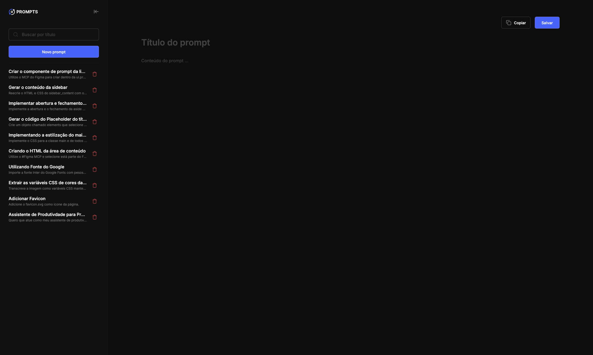

# NLW Pocket 

https://github.com/user-attachments/assets/b9d83042-de86-4378-a812-b29a5a85d535

> Projeto de Prompt Manager

O Prompt Manager é uma aplicação web prática e intuitiva que permite organizar todos os seus prompts de Inteligência Artificial em um só lugar. 

[🔗 Clique aqui para acessar](https://luprime.github.io/nlw-pocket/)

## 👨‍💻 Tecnologia

- HTML
- CSS
- JavaScript
- Github Copilot
- Git e Github

## 💭 O que aprendi?

Neste projeto aprendi a usar os Copilot (IA) para me auxiliar a codar, sabendo como usar prompts no IA, e não depender apenas dos Copilot, ler o código escrito e avaliar se faz sentido tudo aquilo que foi colocado, muitas vezes se escreve muito mais código do que é necessário, ou até mesmo linhas que podem nos atrapalhar futuramente.

## 📚 Contato

- 📧 - lucas.primati@hotmail.com
- 👨🏽‍💼 - https://www.linkedin.com/in/lucas-primati/
